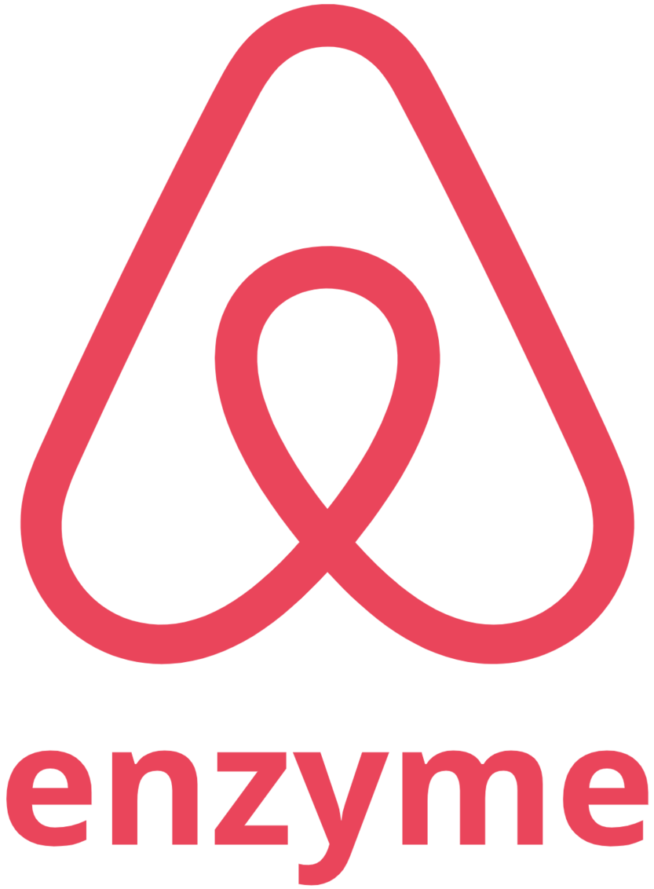

<h2 align="center"> 
  Hi There 
   
  
   
  Thanks 💙 For Being A Valuable Visitor of My Profile Among
   
   
  

  
  

</h2>

Glad to see you here 😊 Hope you are doing good.

### I would like to introduce myself as a self taught 🎓 `Frontend Software Engineer` 💻 💻 💻 

I always try to connect design with code and make something useful. And then I like to say, **"Hello World! I've made something for you"** 😌 And I love to **`share my small bits of knowledge`** with the people to acquire the big one 🎉 🎉 **`Having an open discussion on any tech topic with a cup of coffee`** ☕ is my all-time favorite 💜 💜 Wanna have a discussion with me? Let's connect 🚀 🚀 🚀

 

## 🕸️ Connect with me on:

&nbsp; 
&nbsp; 
&nbsp; 
&nbsp; 
&nbsp; 
&nbsp; 
&nbsp; 

 

## 📓 Some info about me

* 🔭 I’m currently working on building **my own design system**. 
* 🌱 I’m currently learning **Advance Topics of React, NextJS and Javascript**.
* 👯 I’m looking to collaborate on any **JS/React related Open Source Project**.
* 💬 Ask me about **JS, React, CSS related queestions**. I would be happy to share my knowledge.
* 🐱 🐶 I **love cats and dogs**. Please don't hurt them 🙏 🙏

 

## 🛠️ I'm Skilled At:

&nbsp; &nbsp; &nbsp; 
&nbsp; &nbsp; &nbsp; 
&nbsp; &nbsp; &nbsp; 
&nbsp; &nbsp; &nbsp; 
&nbsp; &nbsp; &nbsp; 
&nbsp; &nbsp; &nbsp; 
&nbsp; &nbsp; &nbsp; 
&nbsp; &nbsp; &nbsp; 
&nbsp; &nbsp; &nbsp; 
&nbsp; &nbsp; &nbsp; 
&nbsp; &nbsp; &nbsp; 
&nbsp; &nbsp; &nbsp; 

&nbsp; &nbsp; &nbsp; 
&nbsp; &nbsp; &nbsp; 
&nbsp; &nbsp; &nbsp; 

 

## 💼 Platforms I've Used:

&nbsp; &nbsp; &nbsp; 
&nbsp; &nbsp; &nbsp; 
&nbsp; &nbsp; &nbsp; 
&nbsp; &nbsp; &nbsp; 
&nbsp; &nbsp; &nbsp; 
&nbsp; &nbsp; &nbsp; 
&nbsp; &nbsp; &nbsp; 
&nbsp; &nbsp; &nbsp; 

 

## ❓ I believe the `Written Documents 📘` are the best resources for learning things in depth. Do you agree with me?

***Please, click one of the following 👇 bars (as your opinion) and join the open discussion. Thank you*** 😊 💙

 

  
  
  

 

## ✒️ My Latest blogs:

If you love to read blogs, then you can check my latest blogs. 😊 I wrote them with love 💙 for you.

<!-- BLOG-POST-LIST:START -->
- [The Myth You Should Know About && (Short Circuit Syntax) in JSX](https://gopensource.com/the-myth-you-should-know-about-short-circuit-syntax-in-jsx-f61ffc3bfa5e?source=rss-fe97be716b8a------2)
- [Flexbox — Everything You Need to Know (Part: 1 — Flex-Container)](https://blog.prototypr.io/flexbox-everything-you-need-to-know-part-1-flex-container-246e996ffe4d?source=rss-fe97be716b8a------2)
- [5 Principles of UX Design](https://uxplanet.org/5-principles-of-ux-design-d1579e7267db?source=rss-fe97be716b8a------2)
- [Gestalt Principles: Secrets of Hacking Human Brain by Design](https://medium.com/ieee-sb-kuet/gestalt-principles-secrets-of-hacking-human-brain-by-design-85401fe6880d?source=rss-fe97be716b8a------2)
<!-- BLOG-POST-LIST:END -->

 

## 📉 My Stackoverflow Stats:

I always try to give solution to others' problems. And that's how I learnt the most basic things. 😊 Help people, and this will help you back. 💯 🎉

<!-- STACKOVERFLOW:START -->
- [Answer by Showrin Barua for clearTimeout() doesn't work in javascript](https://stackoverflow.com/questions/67695701/cleartimeout-doesnt-work-in-javascript/67695800#67695800)
- [Answer by Showrin Barua for React js onClick can't pass value to method](https://stackoverflow.com/questions/29810914/react-js-onclick-cant-pass-value-to-method/67663491#67663491)
- [Answer by Showrin Barua for How to change a single value in a property in a nested object in an array](https://stackoverflow.com/questions/67655907/how-to-change-a-single-value-in-a-property-in-a-nested-object-in-an-array/67656000#67656000)
- [Answer by Showrin Barua for React - How to prevent re-rendering of all the input fields when input changes](https://stackoverflow.com/questions/67653394/react-how-to-prevent-re-rendering-of-all-the-input-fields-when-input-changes/67653653#67653653)
- [Answer by Showrin Barua for I am trying to update my number with current value get from textinput in JavaScript](https://stackoverflow.com/questions/67638430/i-am-trying-to-update-my-number-with-current-value-get-from-textinput-in-javascr/67638555#67638555)
<!-- STACKOVERFLOW:END -->

 

 

## 📊 My Dev Stats:

  &nbsp;&nbsp;
  
  

 

## ✨ My Top followers

<!--START_SECTION:top-followers-->
<table>
  <tr>
    <td align="center">
      
       
      <a href="https://github.com/lengjibo">冷逸</a>
    </td>
    <td align="center">
      
       
      <a href="https://github.com/sabinlungudotcpp">Sabin Constantin Lungu (2B || !2B)</a>
    </td>
    <td align="center">
      
       
      <a href="https://github.com/ShakilAhmedShaj">Shakil Ahmed Shaj</a>
    </td>
    <td align="center">
      
       
      <a href="https://github.com/sry309">Draven</a>
    </td>
    <td align="center">
      
       
      <a href="https://github.com/jamilxt">jamilxt</a>
    </td>
    <td align="center">
      
       
      <a href="https://github.com/omamazainab">Omama Zainab</a>
    </td>
    <td align="center">
      
       
      <a href="https://github.com/imalisiddique">Ali Siddique</a>
    </td>
  </tr>
</table>
<!--END_SECTION:top-followers-->

 

## 🎖️ Credits

While building this readme, I used some cool open source contents. I want to thank those great people who made these amazing open source contents. I think everyone should do this.

<a href="https://iconscout.com/contributors/pixel-icons">**Pixel Icons**</a>, 
<a href="https://iconscout.com/contributors/jagathish">**Jagathish Saravanan**</a>, 
<a href="https://iconscout.com/contributors/icon-mafia" target="_blank">**Icon Mafia**</a>, 
<a href="https://iconscout.com/contributors/icon-54" target="_blank">**Icon 54**</a>, 
<a href="https://iconscout.com/contributors/icon-mafia" target="_blank">**Icon Mafia**</a>, 
<a href="https://iconscout.com/contributors/maninderkaur">**Maninder Kaur**</a>
they've made some amazing icons in the <a href="https://iconscout.com">**Iconscout**</a>.

<a href="https://github.com/ryanlanciaux">**@ryanlanciaux**</a>, 
<a href="https://github.com/apex">**@Apex**</a>, 
<a href="https://github.com/gautamkrishnar">**@gautamkrishnar**</a>, 
<a href="https://github.com/ouuan">**@ouuan**</a>, 
<a href="https://github.com/DenverCoder1">**@DenverCoder1**</a>, 
<a href="https://github.com/omidnikrah">**@omidnikrah**</a>, 
<a href="https://github.com/anuraghazra">**@anuraghazra**</a>, 
<a href="https://github.com/kmhmubin">**@kmhmubin**</a> - they wrote some useful blogs and built some awesome plug n play projects that can make any profile look cool.

Respect for you all 🏆 Take love brothes ❤️ ❤️ ❤️

